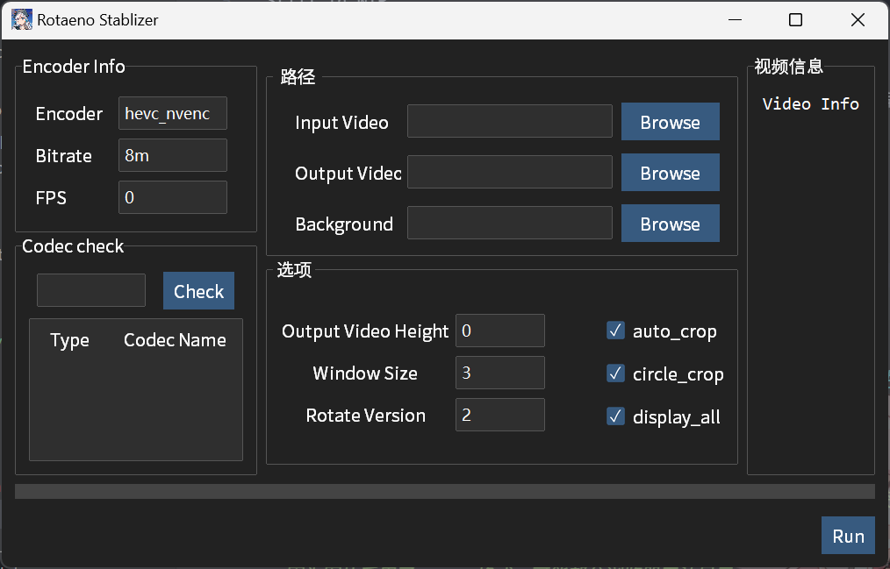

# PY ROTAENO Stablizer GUI

Rotaeno 录屏稳定器


## 特点

1. 使用 ffmpeg 作为视频编解码器，可以选择多个编码器选择（包括显卡编码）
2. 使用 PIPE 作连接，尽量减少中间文件的存储
3. 能尽量使用多核性能
4. 采用平滑曲线，让输出更加稳定

## 界面



Encoder Info:

- Encoder: 选择编码器
- Bitrate: 码率
- FPS: 视频码率（0表示程序自动选择）
  
Codec check:
输入想要的视频编码，回车后获取 ffmpeg 中有的视频编/解码

## 输出视频效果展示

在这里以 [今天不是明天](https://www.bilibili.com/video/BV1pi4y1B7oz)
（作曲 [PIKASONIC](https://space.bilibili.com/262995951) feat. [兰音Reine](https://space.bilibili.com/698029620)）为例

> [!TIP]
> 封面图像可以从 [Rotaeno 中文维基](https://wiki.rotaeno.cn/) 获取

> [!IMPORTANT]
> 因为图片采用了 AVIF 格式，可能部分浏览器无法显示

|       操作       |          语法           |                                 效果                                  |
| :--------------: | :---------------------: | :-------------------------------------------------------------------: |
|     默认效果     |            -            |         <details></details>          |
|   添加音乐封面   | -bg / --background-path | <details></details> |
|  不进行自动裁切  |     --no-auto-crop      |   <details></details>    |
|  不进行圆形裁切  |    --no-circle-crop     | <details></details>  |
| 不输出正方形版本 |    --no-display-all     | <details></details>  |

## TO-DO-LIST

- [x] 帧处理
- [x] SMA 平滑曲线
- [x] 视频处理
- [ ] 编解码器详细设置
- [x] 配置文件
- [x] ~~多线程处理~~ `cv2.warpAffine` 已是多线程
- [ ] 环状频谱图（低优先级）
- [x] 命令行调用
- [x] GUI~~（或 TUI）~~界面

## 安装

### 直接下载

> [!IMPORTANT]
> 因为 `libx264`、`libx265` 要求 GPL-3.0 协议，而本仓库为 LGPL-3.0  
> 所以 Release 中的 `with-ffmpeg` 将使用 LGPL-3.0 协议的 `ffmpeg`  
> （即不包括 `libx264`, `libx265`）

请从 Github Action 下载最新版本

### 命令行

> [!IMPORTANT]
> 请确保你安装了 `Git`, `python` 和 `ffmpeg`，且将其放置在环境变量中

```bash
git clone https://github.com/I-love-study/py-rotaeno-stablizer-gui.git
cd py-rotaeno-stablizer-gui
pip install -r requirements.txt
```

## 使用方法

要求先要启动 v2 直播录像

### 命令行办法(推荐)

```bash
# 下载的可执行文件
./rotaeno_stablizer [options] input_video.mp4
# 下载的 Python 文件
python -m rotaeno_stablizer [options] input_video.mp4
```

如

```bash
./rotaeno_stablizer input_video.mp4 -o ouput_video.mp4
./rotaeno_stablizer -bg Songs_cover.png input_video.mp4
```

或者直接双击或 `python -m rotaeno_stablizer`，将会得到以下文字

<pre style="font-family:Menlo,'DejaVu Sans Mono',consolas,sans-serif, monospace; background-color:#171b22">
<code style="font-family:inherit; background-color:#171b22">请输入原始文件:
输出文件： <span style="color: #808000; text-decoration-color: #808000; font-weight: bold">test_out.mp4</span>
请选择直播模式版本 <span style="color: #800080; text-decoration-color: #800080; font-weight: bold">[1/2]</span> <span style="color: #008080; text-decoration-color: #008080; font-weight: bold">(2)</span>:
是否自动裁切成16:9 <span style="color: #800080; text-decoration-color: #800080; font-weight: bold">([y]/n)</span> :
是否使用圆形切环 <span style="color: #800080; text-decoration-color: #800080; font-weight: bold">([y]/n)</span> :
是否输出正方形版本 <span style="color: #800080; text-decoration-color: #800080; font-weight: bold">([y]/n)</span> :
是否自动裁切成16:9 <span style="color: #800080; text-decoration-color: #800080; font-weight: bold">([y]/n)</span> :
是否需要背景图片 <span style="color: #800080; text-decoration-color: #800080; font-weight: bold">([y]/n)</span> :
请输入背景图片路径: 请输入平滑参数： <span style="color: #008080; text-decoration-color: #008080; font-weight: bold">(3)</span>:
请输入输出视频高度（0 为系统自动选择） <span style="color: #008080; text-decoration-color: #008080; font-weight: bold">(0)</span>:
请选择输出视频编码器 <span style="color: #008080; text-decoration-color: #008080; font-weight: bold">(hevc_nvenc)</span>:
请选择输出视频比特率 <span style="color: #008080; text-decoration-color: #008080; font-weight: bold">(8m)</span>: </code></pre>

## Help Usage

<pre style="font-family:Menlo,'DejaVu Sans Mono',consolas,sans-serif, monospace; background-color:#171b22">
<code style="font-family:inherit; background-color:#171b22">PY Rotaeno Stablizer: <span style="color: #0000ff; text-decoration-color: #0000ff; text-decoration: underline">https://github.com/I-love-study/py-rotaeno-stablizer-gui</span>

<span style="color: #ff8700; text-decoration-color: #ff8700">Usage:</span> <span style="color: #808080; text-decoration-color: #808080">__main__.py</span> [<span style="color: #008080; text-decoration-color: #008080">-h</span>] [<span style="color: #008080; text-decoration-color: #008080">-o</span> <span style="color: #00af87; text-decoration-color: #00af87">OUTPUT_VIDEO</span>] [<span style="color: #008080; text-decoration-color: #008080">--rotation-version</span> <span style="color: #00af87; text-decoration-color: #00af87">ROTATION_VERSION</span>] [<span style="color: #008080; text-decoration-color: #008080">-bg</span> <span style="color: #00af87; text-decoration-color: #00af87">BACKGROUND</span>] [<span style="color: #008080; text-decoration-color: #008080">--auto-crop</span> | <span style="color: #008080; text-decoration-color: #008080">--no-auto-crop</span>] [<span style="color: #008080; text-decoration-color: #008080">--circle-crop</span> | <span style="color: #008080; text-decoration-color: #008080">--no-circle-crop</span>]
                   [<span style="color: #008080; text-decoration-color: #008080">--display-all</span> | <span style="color: #008080; text-decoration-color: #008080">--no-display-all</span>] [<span style="color: #008080; text-decoration-color: #008080">--height</span> <span style="color: #00af87; text-decoration-color: #00af87">HEIGHT</span>] [<span style="color: #008080; text-decoration-color: #008080">--window-size</span> <span style="color: #00af87; text-decoration-color: #00af87">WINDOW_SIZE</span>] [<span style="color: #008080; text-decoration-color: #008080">-c</span> <span style="color: #00af87; text-decoration-color: #00af87">CODEC</span>] [<span style="color: #008080; text-decoration-color: #008080">-b</span> <span style="color: #00af87; text-decoration-color: #00af87">BITRATE</span>]
                   [<span style="color: #008080; text-decoration-color: #008080">input_video</span>]

<span style="color: #ffffff; text-decoration-color: #ffffff">Rotaeno</span>

<span style="color: #ff8700; text-decoration-color: #ff8700">Positional Arguments:</span>
  <span style="color: #008080; text-decoration-color: #008080">input_video</span>

<span style="color: #ff8700; text-decoration-color: #ff8700">Options:</span>
  <span style="color: #008080; text-decoration-color: #008080">-h</span>, <span style="color: #008080; text-decoration-color: #008080">--help</span>            <span style="color: #ffffff; text-decoration-color: #ffffff">帮助</span><span style="color: #008080; text-decoration-color: #008080"> (默认为 </span><span style="color: #008080; text-decoration-color: #008080; font-style: italic">False</span><span style="color: #008080; text-decoration-color: #008080">)</span>
  <span style="color: #008080; text-decoration-color: #008080">-o</span>, <span style="color: #008080; text-decoration-color: #008080">--output-video</span> <span style="color: #00af87; text-decoration-color: #00af87">OUTPUT_VIDEO</span>
  <span style="color: #008080; text-decoration-color: #008080">--rotation-version</span> <span style="color: #00af87; text-decoration-color: #00af87">ROTATION_VERSION</span>
                        <span style="color: #ffffff; text-decoration-color: #ffffff">直播模式版本</span><span style="color: #008080; text-decoration-color: #008080"> (默认为 </span><span style="color: #008080; text-decoration-color: #008080; font-style: italic">2</span><span style="color: #008080; text-decoration-color: #008080">)</span>
  <span style="color: #008080; text-decoration-color: #008080">-bg</span>, <span style="color: #008080; text-decoration-color: #008080">--background</span> <span style="color: #00af87; text-decoration-color: #00af87">BACKGROUND</span>
                        <span style="color: #ffffff; text-decoration-color: #ffffff">歌曲封面照片路径</span><span style="color: #008080; text-decoration-color: #008080"> (默认为 </span><span style="color: #008080; text-decoration-color: #008080; font-style: italic">None</span><span style="color: #008080; text-decoration-color: #008080">)</span>
  <span style="color: #008080; text-decoration-color: #008080">--auto-crop</span>, <span style="color: #008080; text-decoration-color: #008080">--no-auto-crop</span>
                        <span style="color: #ffffff; text-decoration-color: #ffffff">将原视频裁切（不是拉伸）到16:9</span><span style="color: #008080; text-decoration-color: #008080"> (默认为 </span><span style="color: #008080; text-decoration-color: #008080; font-style: italic">True</span><span style="color: #008080; text-decoration-color: #008080">)</span>
  <span style="color: #008080; text-decoration-color: #008080">--circle-crop</span>, <span style="color: #008080; text-decoration-color: #008080">--no-circle-crop</span>
                        <span style="color: #ffffff; text-decoration-color: #ffffff">使用圆形切环</span><span style="color: #008080; text-decoration-color: #008080"> (默认为 </span><span style="color: #008080; text-decoration-color: #008080; font-style: italic">True</span><span style="color: #008080; text-decoration-color: #008080">)</span>
  <span style="color: #008080; text-decoration-color: #008080">--display-all</span>, <span style="color: #008080; text-decoration-color: #008080">--no-display-all</span>
                        <span style="color: #ffffff; text-decoration-color: #ffffff">输出正方形版本</span><span style="color: #008080; text-decoration-color: #008080"> (默认为 </span><span style="color: #008080; text-decoration-color: #008080; font-style: italic">True</span><span style="color: #008080; text-decoration-color: #008080">)</span>
  <span style="color: #008080; text-decoration-color: #008080">--height</span> <span style="color: #00af87; text-decoration-color: #00af87">HEIGHT</span>       <span style="color: #ffffff; text-decoration-color: #ffffff">输出视频高度</span><span style="color: #008080; text-decoration-color: #008080"> (默认为 </span><span style="color: #008080; text-decoration-color: #008080; font-style: italic">0</span><span style="color: #008080; text-decoration-color: #008080">)</span>
  <span style="color: #008080; text-decoration-color: #008080">--window-size</span> <span style="color: #00af87; text-decoration-color: #00af87">WINDOW_SIZE</span>
                        <span style="color: #ffffff; text-decoration-color: #ffffff">平滑参数（参数越高越平滑）</span><span style="color: #008080; text-decoration-color: #008080"> (默认为 </span><span style="color: #008080; text-decoration-color: #008080; font-style: italic">3</span><span style="color: #008080; text-decoration-color: #008080">)</span>
  <span style="color: #008080; text-decoration-color: #008080">-c</span>, <span style="color: #008080; text-decoration-color: #008080">--codec</span> <span style="color: #00af87; text-decoration-color: #00af87">CODEC</span>     <span style="color: #ffffff; text-decoration-color: #ffffff">输出视频所使用的编码器</span><span style="color: #008080; text-decoration-color: #008080"> (默认为 </span><span style="color: #008080; text-decoration-color: #008080; font-style: italic">hevc_nvenc</span><span style="color: #008080; text-decoration-color: #008080">)</span>
  <span style="color: #008080; text-decoration-color: #008080">-b</span>, <span style="color: #008080; text-decoration-color: #008080">--bitrate</span> <span style="color: #00af87; text-decoration-color: #00af87">BITRATE</span>
                        <span style="color: #ffffff; text-decoration-color: #ffffff">输出视频码率（不包含音频）</span><span style="color: #008080; text-decoration-color: #008080"> (默认为 </span><span style="color: #008080; text-decoration-color: #008080; font-style: italic">8m</span><span style="color: #008080; text-decoration-color: #008080">)</span>
</code></pre>

## 相关项目

[Lawrenceeeeeeee/python_rotaeno_stabilizer](https://github.com/Lawrenceeeeeeee/python_rotaeno_stabilizer)

[linnaea/obs-rotaeno-stablizer](https://github.com/linnaea/obs-rotaeno-stablizer)
