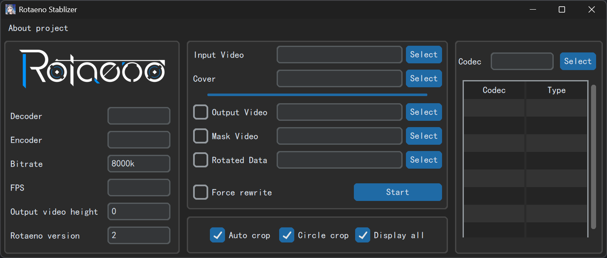

# PY ROTAENO Stablizer GUI

Rotaeno 录屏稳定器


## 特点

1. 使用 ffmpeg 作为视频编解码器，可以选择多个编码器选择（包括显卡编解码器）
2. 通过直接将旋转角度传递给 ffmpeg ，提升因 PIPE 传输而造成的短板效应（特别是当输入视频分辨率达到 4k 及以上时）
3. 可直接输出掩码的选项，使用户可以通过掩码导入 PR 或 达芬奇 进行二次创作

## 界面

浅色：


暗色：



Encoder Info:

- Decoder: 选择解码器（空为自动选择）
- Encoder: 选择编码器（空为自动选择）
- Bitrate: 码率（默认视频 8000 kbps）
- FPS: 视频码率（0表示程序自动选择）
- Output video height: 输出视频的高度（0表示不调整）
- Rotaeno version: Rotaeno 旋转版本（默认为 2(V2)）


Codec check:
输入想要的视频编码，回车后获取 ffmpeg 中有的视频编/解码

## 输出视频效果展示

在这里以 [今天不是明天](https://www.bilibili.com/video/BV1pi4y1B7oz)
（作曲 [PIKASONIC](https://space.bilibili.com/262995951) feat. [兰音Reine](https://space.bilibili.com/698029620)）为例

> [!TIP]
> 封面图像可以从 [Rotaeno 中文维基](https://wiki.rotaeno.cn/) 获取

> [!IMPORTANT]
> 因为图片采用了 AVIF 格式，可能部分浏览器无法显示

|       操作       |          语法           |                                 效果                                  |
| :--------------: | :---------------------: | :-------------------------------------------------------------------: |
|     默认效果     |            -            |         <details></details>          |
|   添加音乐封面   | -bg / --background-path | <details></details> |
|  不进行自动裁切  |     --no-auto-crop      |   <details></details>    |
|  不进行圆形裁切  |    --no-circle-crop     | <details></details>  |
| 不输出正方形版本 |    --no-display-all     | <details></details>  |

## 安装

### 直接下载 ( Windows )

> [!IMPORTANT]
> 请提前下载好 `ffmpeg`，并将其放置在仓库或环境变量中，以保证 Stablizer 能够正确调用 `ffmpeg`

请从 Releases 中下载最新版本的 `rotaeno_stablizer.7z`，并**解压后**运行。

### 命令行源码运行 ( All )

> [!IMPORTANT]
> 请确保你安装了 `Git`, `python` 和 `ffmpeg`，且将其放置在环境变量中

```bash
git clone https://github.com/I-love-study/py-rotaeno-stablizer-gui.git
cd py-rotaeno-stablizer-gui
pip install -r requirements.txt
```

## 使用方法

要求先要启动 v2 直播录像

具体需要打开 直播模式

### GUI 办法（推荐）


### 命令行办法

```bash
# 下载的可执行文件
./rotaeno_stablizer [options] input_video.mp4
# 下载的 Python 文件
python -m rotaeno_stablizer [options] input_video.mp4
```

如

```bash
./rotaeno_stablizer input_video.mp4 -o ouput_video.mp4
./rotaeno_stablizer -bg Songs_cover.png input_video.mp4
```

## 相关项目

[Lawrenceeeeeeee/python_rotaeno_stabilizer](https://github.com/Lawrenceeeeeeee/python_rotaeno_stabilizer)

[linnaea/obs-rotaeno-stablizer](https://github.com/linnaea/obs-rotaeno-stablizer)
